# whack-a-mole-java
> Whack-A-Mole - Java Swing Game using timed events and score logic

> Advisor: Dr.Koteswar Rao Jerripothula

> Simple Java Swing desktop game implementing a 3x3 Whack-A-Mole with Modern-themed
assets, timed mole and Plant movement, score tracking, and game-over logic.

> TechStack: Java, Swing, AWT, javax.swing.Timer, ImageIcon, VS Code

- Author: [Kintsugi-Programmer](https://github.com/kintsugi-programmer)


> Disclaimer: The content presented here is a curated blend of my personal learning journey, experiences, open-source documentation, and invaluable knowledge gained from diverse sources. I do not claim sole ownership over all the material; this is a community-driven effort to learn, share, and grow together.

## Table of Contents
- [whack-a-mole-java](#whack-a-mole-java)
  - [Table of Contents](#table-of-contents)
  - [Introduction](#introduction)
    - [Game Overview](#game-overview)
  - [Project Setup](#project-setup)
    - [Development Environment](#development-environment)
    - [Project Creation Steps](#project-creation-steps)
    - [Initial Project Structure](#initial-project-structure)
    - [Download Required Files](#download-required-files)
    - [Initial App.java Setup](#initial-appjava-setup)
  - [Game Window Setup](#game-window-setup)
    - [Window Specifications](#window-specifications)
    - [Creating the Window Frame](#creating-the-window-frame)
    - [Import Statements](#import-statements)
    - [Frame Properties](#frame-properties)
    - [Important Note on Timing](#important-note-on-timing)
  - [Text Panel and Score Display](#text-panel-and-score-display)
    - [Creating the Text Panel](#creating-the-text-panel)
    - [Formatting the Text Label](#formatting-the-text-label)
    - [Adding to Frame](#adding-to-frame)
  - [Game Board Panel Setup](#game-board-panel-setup)
    - [Creating the Board Panel](#creating-the-board-panel)
    - [Optional Styling](#optional-styling)
  - [Creating Buttons for Tiles](#creating-buttons-for-tiles)
    - [Button Array Setup](#button-array-setup)
    - [Creating and Adding Buttons](#creating-and-adding-buttons)
  - [Loading and Scaling Images](#loading-and-scaling-images)
    - [Image Files](#image-files)
    - [Loading and Scaling Images](#loading-and-scaling-images-1)
    - [Explanation of Image Loading Process](#explanation-of-image-loading-process)
    - [Why Two-Step Process?](#why-two-step-process)
    - [Removing Button Focus Rectangle](#removing-button-focus-rectangle)
  - [Variables for Game State](#variables-for-game-state)
  - [Moving the Mole](#moving-the-mole)
    - [Mole Timer Setup](#mole-timer-setup)
    - [Why Use Intermediate Variable?](#why-use-intermediate-variable)
  - [Moving the Plant](#moving-the-plant)
    - [Plant Timer Setup](#plant-timer-setup)
    - [Why Different Timer Values?](#why-different-timer-values)
  - [Handling Tile Conflicts](#handling-tile-conflicts)
    - [The Conflict Problem](#the-conflict-problem)
    - [Solution: Tile Occupancy Check](#solution-tile-occupancy-check)
    - [How It Works](#how-it-works)
  - [Detecting Button Clicks](#detecting-button-clicks)
    - [Adding Click Listeners to Tiles](#adding-click-listeners-to-tiles)
    - [Type Casting](#type-casting)
    - [Mole Click Behavior](#mole-click-behavior)
    - [Plant Click Behavior](#plant-click-behavior)
  - [Complete Game Flow](#complete-game-flow)
    - [Game Sequence](#game-sequence)
    - [Important Implementation Details](#important-implementation-details)
  - [Possible Enhancements](#possible-enhancements)
    - [Enhancement 1: Hole instead of null spaces](#enhancement-1-hole-instead-of-null-spaces)
    - [Enhancement 2: GameOver Mole Teasing Buttons](#enhancement-2-gameover-mole-teasing-buttons)
    - [Enhancement 3: Second Piranha Plant](#enhancement-3-second-piranha-plant)
    - [Enhancement 4: Reset Button](#enhancement-4-reset-button)
    - [Enhancement 5: High Score Tracking](#enhancement-5-high-score-tracking)
  - [Complete Code Structure](#complete-code-structure)
    - [Class Variables (Instance Variables)](#class-variables-instance-variables)
    - [Constructor Method](#constructor-method)
  - [Key Concepts Learned](#key-concepts-learned)
    - [GUI Components](#gui-components)
    - [Layouts](#layouts)
    - [Event Handling](#event-handling)
    - [Image Processing](#image-processing)
    - [Game Logic](#game-logic)
  - [Development Notes](#development-notes)
    - [Performance Tip](#performance-tip)
    - [Testing Approach](#testing-approach)
    - [Debugging](#debugging)
  - [Conclusion](#conclusion)


## Introduction

This Documentation teaches how to create a simple Whack-a-Mole game in Java with a graphical user interface (GUI). This is an excellent beginner project for those starting to learn Java and GUI development.

### Game Overview

- **Game Elements**: Uses images AI-Generated
- **Game Board**: Nine tiles arranged in a 3x3 grid
- **Main Character**: A mole that hops around the tiles
- **Obstacle**: A Piranha Plant that also moves around the board
- **Objective**: Click on tiles with the mole to earn points
- **Losing Condition**: Clicking on the Piranha Plant results in "Game Over"

## Project Setup

### Development Environment

- **IDE**: Visual Studio Code
- **Language**: Java
- **Prerequisites**: Java setup in Visual Studio Code (Documentation available in video description)

### Project Creation Steps

1. Open Visual Studio Code
2. Use keyboard shortcut: `Ctrl + Shift + P`
3. Select "Java: Create Java Project"
4. Choose "No build tools"
5. Create project on Desktop
6. Name the project: "whack-a-mole"
7. This creates a project folder with a `src` folder containing `App.java`

- java readme default
```md
## Getting Started

Welcome to the VS Code Java world. Here is a guideline to help you get started to write Java code in Visual Studio Code.

## Folder Structure

The workspace contains two folders by default, where:

- `src`: the folder to maintain sources
- `lib`: the folder to maintain dependencies

Meanwhile, the compiled output files will be generated in the `bin` folder by default.

> If you want to customize the folder structure, open `.vscode/settings.json` and update the related settings there.

## Dependency Management

The `JAVA PROJECTS` view allows you to manage your dependencies. More details can be found [here](https://github.com/microsoft/vscode-java-dependency#manage-dependencies).

```

### Initial Project Structure

```
whack-a-mole/
├── src/
│   ├── App.java
│   ├── WhackAMole.java (create this file)
│   ├── piranha.PNG (download)
│   └── monty.PNG (download)
```

### Download Required Files

Before coding:
1. Visit GitHub link in video description
2. Download two image files:
   - `piranha.PNG` (Piranha Plant image)
   - `monty.PNG` (Mole image)
3. Drag both images into the `src` folder

### Initial App.java Setup

Modify the default `App.java` file:

```java
public class App {
    public static void main(String[] args) throws Exception {
        new WhackAMole();
    }
}
```

- Remove the default print statement
- Create an instance of the `WhackAMole` class
    ```java
    public class WhackAMole {
    }
    ```
- Collapse the App.java file as main code goes in WhackAMole.java

## Game Window Setup

- creating window
- 
### Window Specifications

- **Width**: 600 pixels
- **Height**: 650 pixels
- **Note**: Game board is 600x600, but height is 650 to provide room for a score display text at the top

### Creating the Window Frame

```java
// Create variables
int boardWidth = 600;
int boardHeight = 650;
JFrame frame = new JFrame("Whack-A-Mole");
```

### Import Statements

Add these import statements at the top of WhackAMole.java:

```java
import java.awt.*; // GUI
import java.awt.event.*;
import java.util.Random; // Random Positions
import javax.swing.*; // GUI , Contain JFrame
```

> Originally javax was intended to be for extensions, and sometimes things would be promoted out of javax into java.

### Frame Properties

Set frame properties in the constructor:

```java
frame.setVisible(true);
frame.setSize(boardWidth, boardHeight);
frame.setLocationRelativeTo(null);  // Opens window at center of screen
frame.setResizable(false);
frame.setDefaultCloseOperation(JFrame.EXIT_ON_CLOSE);  // X button terminates program
frame.setLayout(new BorderLayout());
```
this will create empty window blank, when run App.java

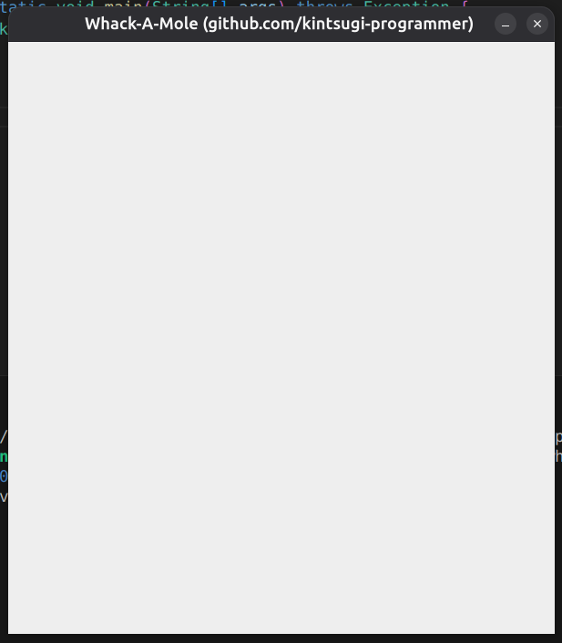

### Important Note on Timing

Place `frame.setVisible(true)` at the very end of the constructor after all components are added. This ensures all components load before the window becomes visible, preventing slow loading of individual buttons.

## Text Panel and Score Display

### Creating the Text Panel

```java
// Create text label
JLabel textLabel = new JLabel();

// Create text panel to hold label
JPanel textPanel = new JPanel();
```

### Formatting the Text Label

```java
textLabel.setFont(new Font("Arial", Font.PLAIN, 50));// 50px
textLabel.setHorizontalAlignment(JLabel.CENTER);  // Centers text horizontally
textLabel.setText("Score: 0");
textLabel.setOpaque(true);  // Makes background visible
```

### Adding to Frame

```java
textPanel.setLayout(new BorderLayout());
textPanel.add(textLabel);// add textLabel in textPanel
frame.add(textPanel);// add textPanel to frame
```

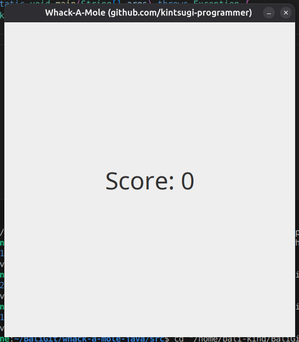

```java
frame.add(textPanel, BorderLayout.NORTH);  // BorderLayout.NORTH pushes panel to top // add textPanel to frame
```

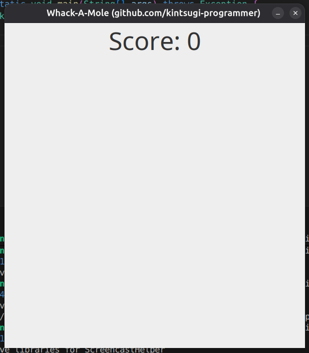

## Game Board Panel Setup

### Creating the Board Panel

```java
JPanel boardPanel = new JPanel();
boardPanel.setLayout(new GridLayout(3, 3));  // 3x3 grid of tiles
frame.add(boardPanel);
```

### Optional Styling

```java
boardPanel.setBackground(Color.BLACK);  // Optional: makes background visible during development
```
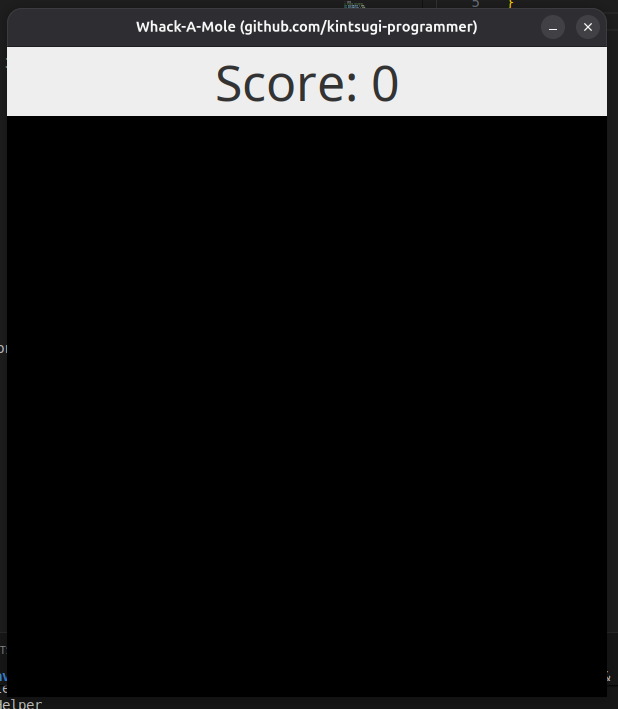

## Creating Buttons for Tiles

### Button Array Setup

Create an array to track all nine buttons(outside constructor):

```java
JButton[] board = new JButton[9];
```

### Creating and Adding Buttons

Use a for loop to create nine buttons:

```java
for (int i = 0; i < 9; i++) {
    JButton tile = new JButton();
    board[i] = tile;
    boardPanel.add(tile);
}
```

Each button represents one tile on the game board; also clickable

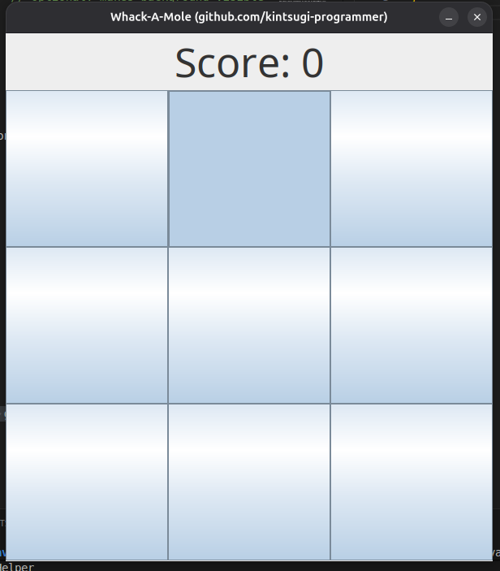

## Loading and Scaling Images

Make ImageIcon outside Constructors

```java
    ImageIcon moleIcon;
    ImageIcon plantIcon;
```
Inside Constructor

```java
    // Loading and Scaling Images
    moleIcon = new ImageIcon(getClass().getResource("./monty.png"));

    // constructing buttons/ tiles 
    // JButton button1 = new JButton(); // one button
    for ( int  i = 0; i<9; i++){ // using loop, to create tiles/buttons; instead of hardcode
        JButton tile = new JButton();
        board[i] = tile;
        boardPanel.add(tile); // appending to boardPanel Grid one-by-one
        tile.setIcon(moleIcon); // IMAGE INSIDE TILE
    }   // Each button represents one tile on the game board.
        // also clickable

```

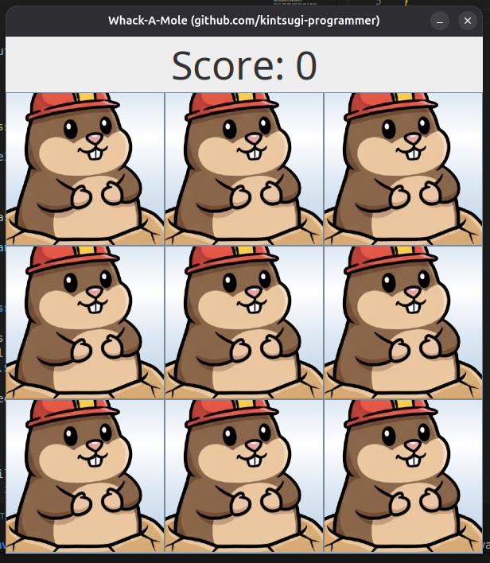

now as you can see, image is not setted ,but; image is not scaled...

### Image Files

The game uses two image files:
- `piranha.png` - Piranha Plant image
- `monty.png` - Mole image

put it in src for direct access ease
```bash
bali-king@war-machine:~/BaliGit/whack-a-mole-java/src$ tree
.
├── App.class
├── App.java
├── monty2.png
├── monty.png
├── piranha.png
├── WhackAMole.class
└── WhackAMole.java

1 directory, 7 files
bali-king@war-machine:~/BaliGit/whack-a-mole-java/src$ 
```

### Loading and Scaling Images

The images must be scaled to fit the buttons (150x150 pixels). The process involves two steps:

```java
// Load mole image
Image moleImage = new ImageIcon(getClass().getResource("./monty.png")).getImage(); 
moleIcon = new ImageIcon(moleImage.getScaledInstance(150, 150, Image.SCALE_SMOOTH));

// Load plant image
Image plantImage = new ImageIcon(getClass().getResource("./piranha.png")).getImage();
plantIcon = new ImageIcon(plantImage.getScaledInstance(150, 150, Image.SCALE_SMOOTH));
```

### Explanation of Image Loading Process

1. **getClass().getResource()** - Loads the image file from the source folder
2. **getImage()** - Extracts the actual image from the ImageIcon
3. **getScaledInstance(150, 150, Image.SCALE_SMOOTH)** - Resizes image to 150x150 pixels with smooth scaling
4. **new ImageIcon()** - Converts scaled image back to ImageIcon for button display

### Why Two-Step Process?

- Cannot directly set ImageIcon from file path with scaling
- Must first get the image, then scale it, then create ImageIcon from scaled image

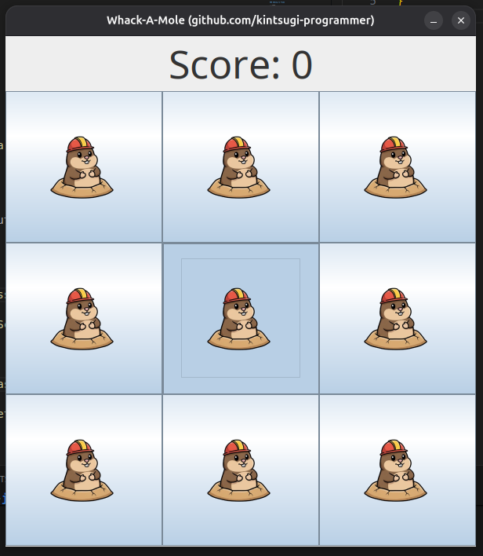

### Removing Button Focus Rectangle

Disable the focus rectangle that appears when buttons are clicked:

```java
tile.setFocusable(false);
```

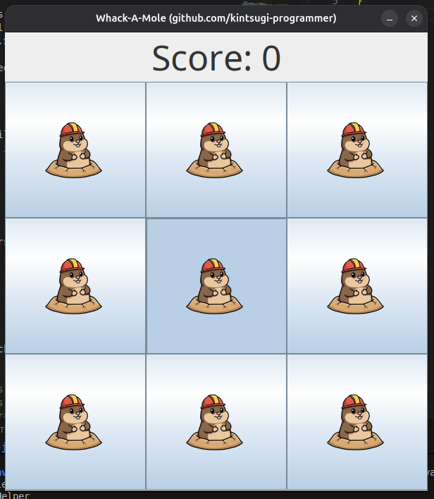

## Variables for Game State

Create these instance variables to track game state:

```java
JButton currentMoleTile;      // Tracks which button currently has the mole
JButton currentPlantTile;     // Tracks which button currently has the plant
Random random = new Random();  // For random tile selection
Timer setMoleTimer;            // Timer to move mole to new tiles
Timer setPlantTimer;           // Timer to move plant to new tiles
int score = 0;                 // Tracks player score
```

## Moving the Mole

### Mole Timer Setup

Create a timer that moves the mole every 1000 milliseconds (1 second):

```java
setMoleTimer = new Timer(1000, new ActionListener() {
    public void actionPerformed(ActionEvent e) {
        // Remove mole from current tile
        if (currentMoleTile != null) {
            currentMoleTile.setIcon(null);  // Remove image from button
            currentMoleTile = null;
        }

        // // normal way, but doesn't check if other object also have same tile or not
        // currentMoleTile = board[random.nextInt(9)];
        // currentMoleTile.setIcon(moleIcon);
        
        // new way, makes objects of random number and check if plant already is at tile
          // Select random tile
          int num = random.nextInt(9);  // Random number 0-8
          JButton tile = board[num];
          
          // Check if plant is on this tile (avoid conflict)
          if (currentPlantTile == tile) {
              return;  // Skip this turn
          }
          
          // Place mole on new tile
          currentMoleTile = tile;
          currentMoleTile.setIcon(moleIcon);
    }
});

setMoleTimer.start();
```

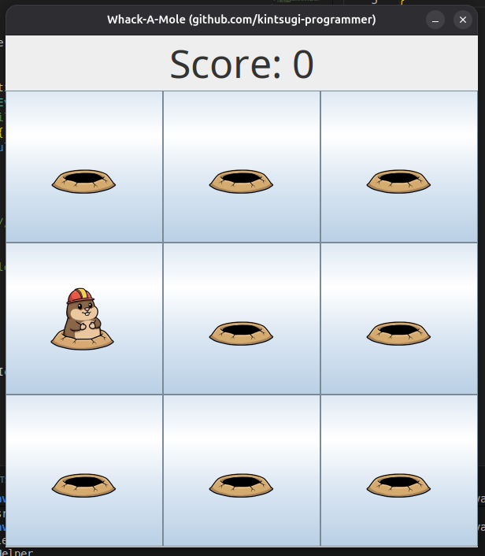

### Why Use Intermediate Variable?

The code uses:
```java
JButton tile = board[num];
```

Instead of:
```java
currentMoleTile = board[num];
```

This is because there's an edge case that must be covered (conflict checking with plant tile).

## Moving the Plant

### Plant Timer Setup

Create a timer that moves the plant every 1500 milliseconds (1.5 seconds):

```java
setPlantTimer = new Timer(1500, new ActionListener() {
    public void actionPerformed(ActionEvent e) {
        // Remove plant from current tile
        if (currentPlantTile != null) {
            currentPlantTile.setIcon(null);  // Remove image from button
            currentPlantTile = null;
        }
        
        // Select random tile
        int num = random.nextInt(9);  // Random number 0-8
        JButton tile = board[num];
        
        // Check if mole is on this tile (avoid conflict)
        if (currentMoleTile == tile) {
            return;  // Skip this turn
        }
        
        // Place plant on new tile
        currentPlantTile = tile;
        currentPlantTile.setIcon(plantIcon);
    }
});

setPlantTimer.start();
```


### Why Different Timer Values?

- Mole: 1000 milliseconds (moves every second)
- Plant: 1500 milliseconds (moves every 1.5 seconds)
- This creates variety in movement patterns

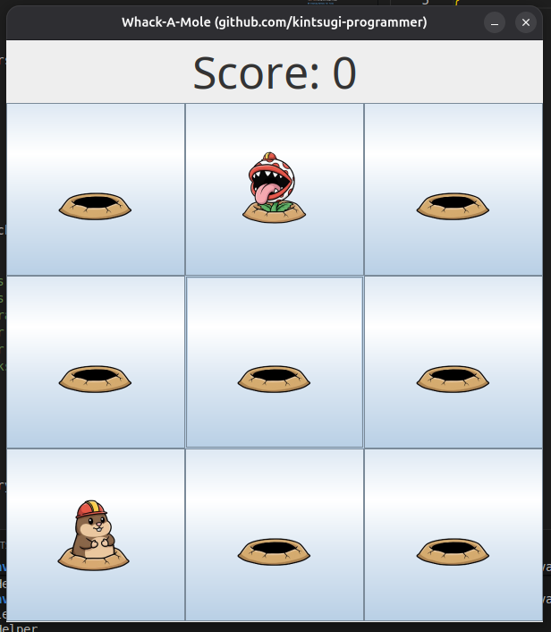

## Handling Tile Conflicts

### The Conflict Problem

Since there are only 9 tiles and two separate timers randomly placing mole and plant:
- High chance both timers select the same tile
- One icon overwrites the other
- Only one image displays on the shared tile
- Game logic becomes inconsistent

### Solution: Tile Occupancy Check

When placing mole or plant, check if the target tile is occupied:

**In Mole Timer:**
```java
if (currentPlantTile == tile) {
    return;  // Skip this turn if plant is here
}
```

**In Plant Timer:**
```java
if (currentMoleTile == tile) {
    return;  // Skip this turn if mole is here
}
```

### How It Works

1. If selected tile already has mole or plant, return early
2. The current icon remains on that tile
3. No overwriting occurs
4. Game logic remains consistent

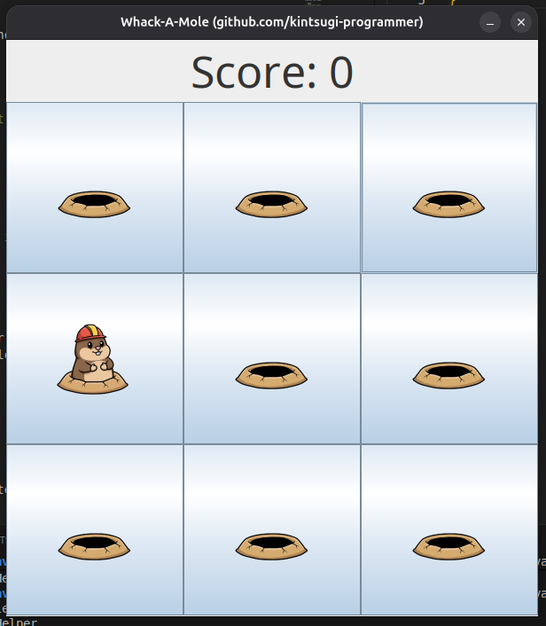
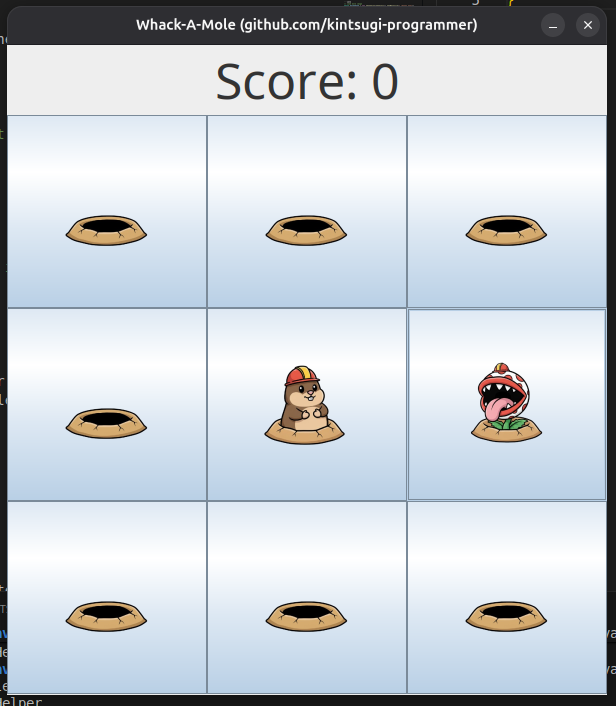

> after resizing to make pleasing

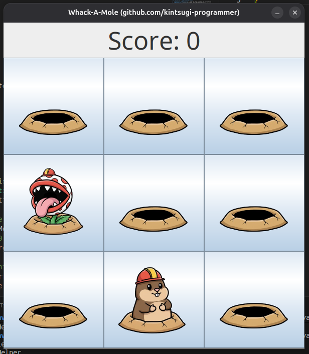

## Detecting Button Clicks

### Adding Click Listeners to Tiles

In the for loop where buttons are created, add an action listener to each button:

```java
for (int i = 0; i < 9; i++) {
    JButton tile = new JButton();
    board[i] = tile;
    boardPanel.add(tile);
    
    // Add click handler
    tile.addActionListener(new ActionListener() {
        public void actionPerformed(ActionEvent e) {
            JButton clickedTile = (JButton) e.getSource();// input user click & typecast that input to button
            
            // Check if clicked on mole
            if (clickedTile == currentMoleTile) {
                score += 10;  // Add 10 points
                textLabel.setText("Score: " + Integer.toString(score));
            }
            // Check if clicked on plant
            else if (clickedTile == currentPlantTile) {
                textLabel.setText("Game Over");
                
                // Stop movement
                setMoleTimer.stop();
                setPlantTimer.stop();
                
                // Disable all buttons
                for (int i = 0; i < 9; i++) {
                    board[i].setEnabled(false);
                }
            }
        }
    });
}
```

### Type Casting

```java
JButton clickedTile = (JButton) e.getSource();
```

- `e.getSource()` returns an Object
- Must cast to JButton to access button-specific methods

### Mole Click Behavior

- Increment score by 10 points
- Update score text display
- Mole continues moving (no stopping)
- Player can continue playing

### Plant Click Behavior

- Display "Game Over" text
- Stop mole timer: `setMoleTimer.stop()`
- Stop plant timer: `setPlantTimer.stop()`
- Disable all buttons: `board[i].setEnabled(false)`
- Mole and plant stop moving
- Buttons become grayed out and unclickable

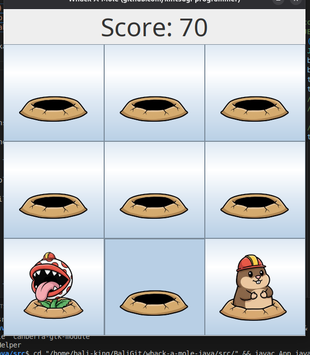

## Complete Game Flow

### Game Sequence

1. Window opens with 3x3 grid of buttons
2. Score displays at top as "Score: 0"
3. Mole randomly appears on one tile and moves every 1 second
4. Plant randomly appears on different tile and moves every 1.5 seconds
5. Player clicks on tiles containing mole to earn points (+10 each)
6. Player tries to avoid clicking on tile with plant
7. Clicking plant triggers "Game Over"
8. When game ends:
   - Timers stop
   - All buttons disabled
   - Text changes to "Game Over"

### Important Implementation Details

- Mole and plant can never occupy same tile (prevented by checks)
- Score updates only when mole is clicked
- Game cannot be played after "Game Over" unless program is restarted
- Focus rectangles removed from buttons for cleaner appearance
- All components load before window becomes visible

## Possible Enhancements

The basic game can be improved with these features:

### Enhancement 1: Hole instead of null spaces
```java
    ImageIcon holeIcon; // before constructor

    // Inside constructor
    Image holeImage = new ImageIcon(getClass().getResource("./hole.png")).getImage();
    holeIcon = new ImageIcon(holeImage.getScaledInstance(150, 150, Image.SCALE_SMOOTH));
```

> then replace icon tiles `null` with `holeIcon`

### Enhancement 2: GameOver Mole Teasing Buttons
```java
ImageIcon molemockingIcon;
```
```java
// inside constructor
Image molemockingImage = new ImageIcon(getClass().getResource("./montymocking.png")).getImage();

molemockingIcon = new ImageIcon(molemockingImage.getScaledInstance(250, 250, Image.SCALE_SMOOTH));
```
```java
// inside gameover logic
// Disable all buttons
for (int i = 0; i<9; i++){
    board[i].setIcon(molemockingIcon);
    board[i].setEnabled(false);
}
```

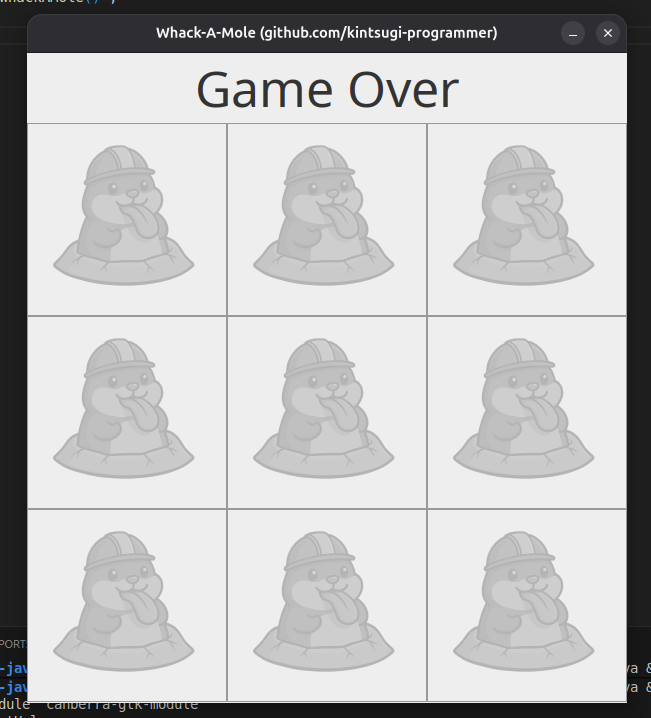

### Enhancement 3: Second Piranha Plant

This enhancement adds a **second independent Piranha Plant** to the game, increasing difficulty without changing the core mechanics.

**Implementation details:**
- A new variable `currentPlantTile2` tracks the second plant’s position.
- A second timer `setPlantTimer2` controls the movement of the second plant.
- Each plant:
  - Moves on its own timer interval.
  - Cannot occupy the same tile as the mole.
  - Cannot occupy the same tile as the other plant.
- Clicking **either** plant immediately ends the game.

**Gameplay impact:**
- Players must now track two hazards instead of one.
- Different timer intervals create unpredictable movement patterns.
- The difficulty increases naturally while keeping the implementation simple and readable.


### Enhancement 4: Reset Button

- Add button to reset the game
- Player can play multiple rounds without restarting program
- Implement reset logic to reinitialize game state

### Enhancement 5: High Score Tracking

- Create variable to track all-time high score
- Display high score on screen
- Compare current score with high score
- Persist high score between games

## Complete Code Structure

### Class Variables (Instance Variables)

```java
int boardWidth = 600;
int boardHeight = 650;
JFrame frame;
JPanel textPanel;
JLabel textLabel;
JPanel boardPanel;
JButton[] board;
ImageIcon moleIcon;
ImageIcon plantIcon;
JButton currentMoleTile;
JButton currentPlantTile;
Random random;
Timer setMoleTimer;
Timer setPlantTimer;
int score;
```

### Constructor Method

Contains all initialization code:
- Frame setup
- Component creation
- Image loading and scaling
- Button creation with event listeners
- Timer setup with movement logic
- Frame visibility set at end

## Key Concepts Learned

### GUI Components
- JFrame: Main window container
- JPanel: Layout containers (text panel, board panel)
- JButton: Interactive tiles
- JLabel: Text display

### Layouts
- BorderLayout: For overall window layout (North for text panel)
- GridLayout: For 3x3 button grid

### Event Handling
- ActionListener: Handles button clicks
- Timer: Handles repeating events (mole/plant movement)
- ActionEvent: Contains event information

### Image Processing
- Loading images from files using getResource()
- Scaling images to specific dimensions
- Converting images to ImageIcons for display
- Using ImageIcon objects on buttons

### Game Logic
- State tracking (current mole/plant position, score)
- Conflict prevention (checking tile occupancy)
- Game flow control (stopping timers, disabling buttons)
- User feedback (updating score display)

## Development Notes

### Performance Tip

Set `frame.setVisible(true)` at the very end of constructor to ensure all components load before window displays. This prevents UI components from appearing slowly one by one.

### Testing Approach

- Test each component as it's added
- Verify image scaling displays correctly
- Check that mole and plant move independently
- Verify no conflicts occur on same tile
- Test click detection for both mole and plant
- Confirm game ends properly on plant click

### Debugging

- Use `setBackground(Color.BLACK)` temporarily to visualize panel boundaries
- Watch console for any import errors
- Verify image file names match exactly (case-sensitive)
- Check that resource paths use correct file names with extensions

## Conclusion

This Documentation covers all fundamental aspects of creating a GUI game in Java:
- Window and component creation
- Image loading and manipulation
- Event-driven programming with listeners and timers
- Game state management
- User interaction and feedback

The resulting game is fully functional and provides a solid foundation for learning GUI programming concepts.

---
End-of-File

The [KintsugiStack](https://github.com/kintsugi-programmer/KintsugiStack) repository, authored by Kintsugi-Programmer, is less a comprehensive resource and more an Artifact of Continuous Research and Deep Inquiry into Computer Science and Software Engineering. It serves as a transparent ledger of the author's relentless pursuit of mastery, from the foundational algorithms to modern full-stack implementation.

> Made with 💚 [Kintsugi-Programmer](https://github.com/kintsugi-programmer)